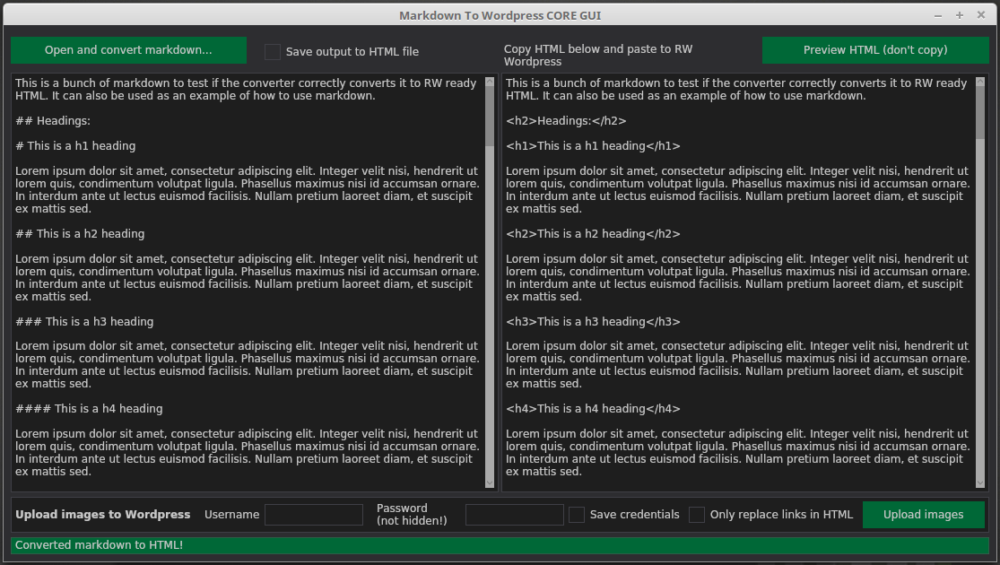
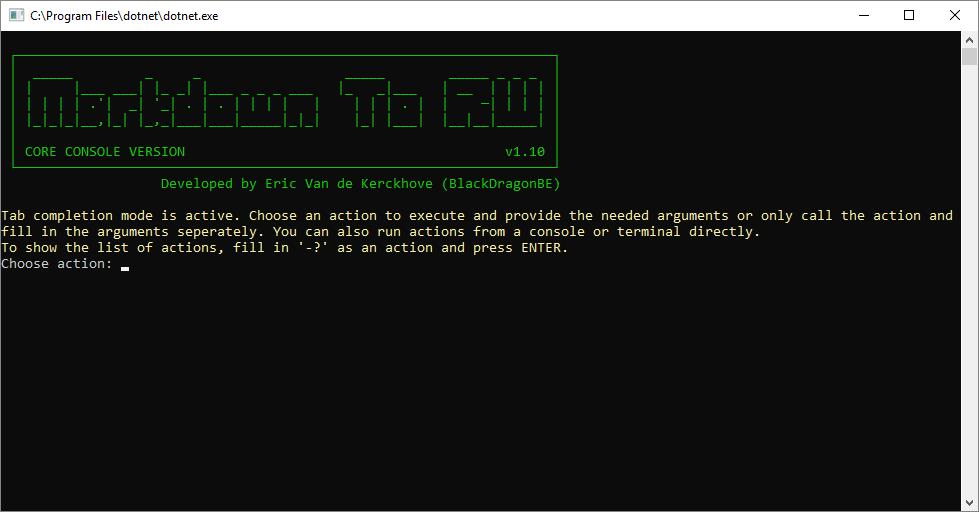
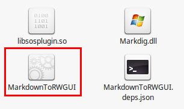
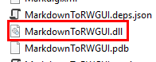

# MarkdownToRW Converter

A handy tool to convert any markdown document to Ray Wenderlich WordPress ready HTML.
It can also batch upload all locally sourced images and replace those sources with the image URLs.

There are currently 2 supported versions of the app, each with 2 variations:

# Versions

**GUI version:**

This version has a graphical interface which makes it easy to verify if the HTML result is what you were expecting.

**Console version:**

A retro console app that's nice and small. It has both a wizard style way of going about the converting and uploading as well as traditional arguments.

**Portable versions:**

These versions are portable as in the binaries & libraries are small and can be shared between different platforms. You do need an install of the .NET Core Framework for your platform for it to work though.

**Self Contained versions:**

The same applications as above, but with all the .NET Core libraries packed with it for every particular platform. These versions include native binaries and libraries and aren't dependent on any other software, but are the largest in size.

# Requirements

**Portable versions**

For the portable version to work, you need the .NET Core libraries for your platform:

- Windows: https://www.microsoft.com/net/download/windows/run
- macOS: https://www.microsoft.com/net/download/macos/run
- linux: https://www.microsoft.com/net/download/linux/run

Make sure to open a console/terminal afterwards and run `dotnet -info` to verify it's installed correctly.

**Self Contained versions**

- Windows: Windows 7 SP1 or later
- macOS: macOS 10.12 Sierra or later
- linux: https://docs.microsoft.com/en-us/dotnet/core/linux-prerequisites?tabs=netcore2x

For up to date list, see: https://github.com/dotnet/core/blob/master/release-notes/2.0/2.0-supported-os.md

The self contained version includes native binaries & libraries for your platform ans thus doesn't require any additional software.
If it doesn't work for any reason, try the **.NET Core Portable** version instead.

(**Note:** The self contained version is the largest by far in file size as it contains a minimal set of .NET Core 2.0 framework libraries)

All of these use the same shared library for converting markdown files and communicating with WordPress so they mostly share the same functionality (and bugs).

# How To Run The Application

For all platforms and versions, download the latest release zip for your platform (if applicable) and unpack it somewhere convenient.
Releases: https://github.com/BlackDragonBE/MarkdownToRW_Converter/releases

## Self Contained versions

### GUI

Run the native executable named **MarkdownToRWGUI** directly. You may have to mark it as executable first depending on your system.

### Console

Run the native executable named **MarkdownToRW**  in a console/terminal. You may have to mark it as executable first depending on your system.

## Portable versions

Open a command prompt or terminal and run:

`dotnet PATH-TO-MarkdownToRWGUI.dll`

or

`dotnet PATH-TO-MarkdownToRW.dll`

depending on the version you've downloaded.

# How To Use

## GUI

**Most checkboxes and buttons have tooltips, be sure to read them for more info.**

Open the markdown and optionally create a converted html version straight away in the same folder as the markdown file. 

## Console

Follow the instructions in the console. It should be pretty straight forward, type in **-?** and press **ENTER** for a list of all commands and arguments.

# To-Do & Nice To Have

**To-Do:**

- Improve HTML preview output
- PDF exporting

**Nice To Have:**

- N/A

# Known Issues

**Console version**:

- N/A

**GUI version**:

- Password field doesn't display password characters, use discretion. This will be fixed once I find a workaround or when the UI library implements this functionality (it's on their to-do list).
- Some report that the app freezes on macOS sometimes. Needs more testing.

**All versions (shared library bugs)**:

- The converter assumes the first image found is the 250x250 feature image shown at the top right of tutorials and articles. It has come to my attention that not all teams use this workflow, some add this image later. I'll make this optional in the next version. Remove the **alignright** class from the output for now and replace it with **aligncenter** if it was incorrectly parsed.
- No updater yet, please download new releases manually. The next release will report if there's a new release available. The next step is a semi-auto updater.
