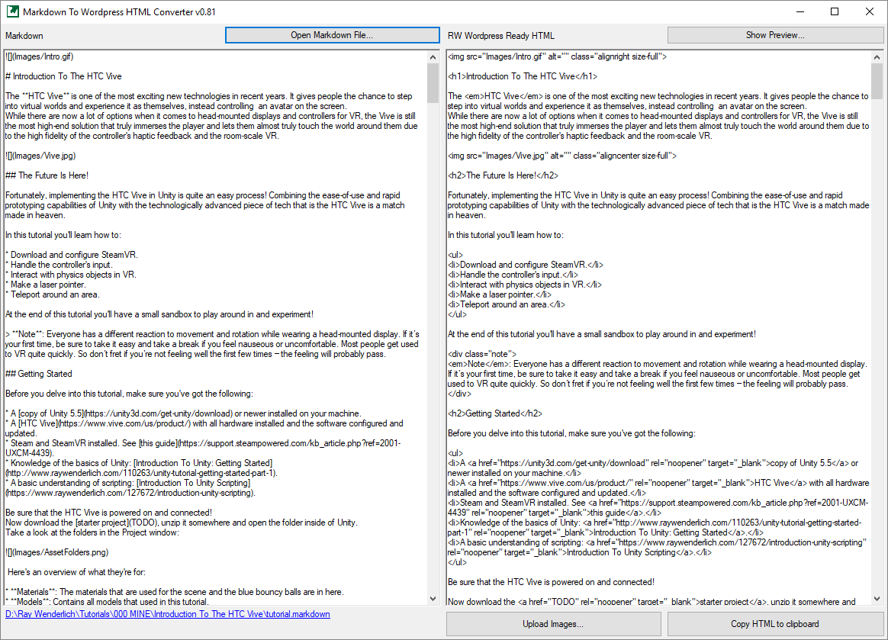

# MarkdownToRW Converter

A portable tool to convert any markdown document to Ray Wenderlich WordPress ready HTML.
It can also batch upload all locally sourced images and replace those sources with the image URLs.

## Requirements

- Windows: .NET Framework 4.6.1
- macOS & linux: Mono Framework

## How To Run The Application

For all platforms, download the latest release zip and unpack it somewhere convenient.
Releases: https://github.com/BlackDragonBE/MarkdownToRW_Converter/releases

### Windows

Run **MarkdownToRW.exe**.

### macOS & linux

1. Download Mono: http://www.mono-project.com/download/stable/
2. Open a terminal.
3. Run this command: **mono --arch=32 PATH-TO-MarkdownToRW.exe**

You can create a shortcut to run this command to make it easier in the future.

## How To Use

Click on the **Open Markdown...** button and choose a markdown file.
The file will now be read and used as input. It will also convert it to a special RW compatible flavor of html and put that on the right side of the window.
You can now preview the result by pressing the **Show Preview...** button or copy the html to your clipboard by pressing the **Copy HTML to clipboard** button.

You can also upload all images locally sourced in your markdown file and update the markdown and HTML with the new image URLs by pressing the Upload Images... button.
This will open up the **Image Uploader** window. To start uploading you need to verify your account first.
Put in your RW WordPress credentials and click the **Verify** button. If your credentials are valid, you'll be greeted and the upload button will become enabled.

**Check that all found images are correct in the list on the right side before moving on and make sure you only upload the images once per tutorial or article.**

Press the upload button, read the warning and make your choice to move on to the actual uploading.
Each image will be separately uploaded to the WordPress Media Library. Check the progress bar at the bottom to see the progress.
Once all images are uploaded, you'll get a prompt and be taken back to the main form. The markdown file, markdown preview and html preview will all be updated with the URLs to the newly uploaded images.

If the uploading fails for any reason, a prompt will show and the rollback will start. This will attempt to delete all uploaded images so you can try again later. **Make sure you can access the RW WordPress before clicking OK in the prompt, not doing so will require you to do manual cleanup of the uploaded images on WordPress.**

Now copy and paste the html in your post and check if the formatting is correct. There may be some edge cases where things can get weird or incorrect. If that's the case, be sure to make an issue here if there isn't one already.

## Known Issues

- The preview is not a 1:1 preview with what you would get on the website itself.
- Code in the preview will appear incorrect if the following characters are used: < > &
- Due to a mono limitation, the applications needs to be run in 32-bit mode on macOS & linux. This should be fixed by Mono somewhere this year (2018) though.
